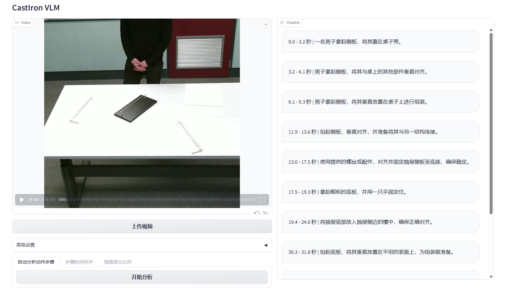

# 动作检测问答系统

## 功能：

1. 视频语义分割：根据教学视频，自动拆解步骤，
2. 视频语义描述：根据提示，结合动作，生成动作指引；
3. 视频语义比对：输入实际操作视频，和教学视频进行比对，生成改进建议；
4. 视频语义解构：生成结构化时序场景图，用于下游应用分析；
5. 视频语义生成：根据标准操作流程，生成视频指引。

## 数据集

* [宜家家居组装](https://ikeaasm.github.io/)

## 参考项目：

* TimeChat([code](https://github.com/RenShuhuai-Andy/TimeChat), [paper](https://arxiv.org/abs/2312.02051))：从BLIP2架构演化而来，数据集主要是YouCook。考虑可以使用宜家组装数据集，重新训练一个针对组装类视频的VLM模型。

* VisualNarrationProceL([code](https://github.com/Yuhan-Shen/VisualNarrationProceL-CVPR21), [paper](https://www.khoury.northeastern.edu/home/eelhami/publications/VisualNarrationProceL-CVPR21.pdf))：专门针对指导类视频和文本之间进行步骤弱对齐的一篇文章。

* HawkEye([paper](https://arxiv.org/pdf/2403.10228.pdf), [code](https://github.com/yellow-binary-tree/HawkEye))：一个基于QFormer的Video Grounding（在视频中准确定位文本描述的片段起止时间的任务）模型，有点像在视频上做二分查找，先粗粒度判断目标事件发生在视频的哪一段，然后递归分析对应的片段直到整个片段都是目标事件结束。

* InternVL([paper](https://arxiv.org/pdf/2312.14238.pdf), [code](https://github.com/OpenGVLab/InternVL))：更大的BLIP2，包括更大的ViT作为视频编码器，QFormer改成了QLLaMa，从32个learnable query增加到96个，模型参数量更大，等等。

## 实施计划：

### BLIP2 + InternLM2，实现图片VQA

目前大部分QFormer变体的模型，都是从[LAVIS](https://github.com/salesforce/LAVIS/tree/main)修改而来，LAVIS的代码质量比较高，可以从这个代码库开始搭建基础框架。

- [x] 使用BLIP2官方代码库，完整跑通BLIP2模型推理；
- [x] 使用BLIP2官方代码库，在本地环境跑通模型训练，使用coco和~~VG数据集~~(vg数据集加载的目录结构和BLIP2的DataLoader需要的不一样，暂时先不管了）；
- [x] 修改BLIP2代码，把LLM模型换成InternLM2-1.8B，重新训练（[文档记录](docs/InternBLIP2.md)）；
- [ ] 按照ImageTextDataset形式构建IKEA Assembly数据集；
- [ ] 在BLIP2训练中加入IKEA Assembly数据集；
- [ ] 评估模型效果。

### TimeChat + InterLM2，实现短视频的DenseCaptioning和VQA

在掌握BLIP2之后，开始改造TimeChat。

- [x] 跑通TimeChat推理；
- [x] 参考TimeIT数据集，构造IKEA Assembly数据集；
- [ ] 使用InternLM2-1.8B模型替换LLM；
- [x] 实现Dense Captioning Demo；
- [ ] 实现VQA Demo；

##### 阶段性Demo

### 实现长视频的Video Grounding

待更新
